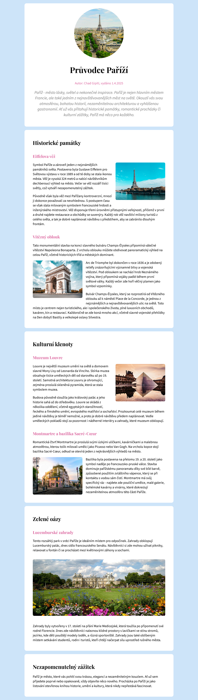

# Projekt: Paříž

*Cvičný projekt pro kurz Staň se kóderkou od Czechitas.*

## Postup

### HTML
- kolem textu udělej vhodné HTML značky (`h1`, `h2`, `h3`, `p`)
- na místa označená komentářem vlož správné obrázky
- obsah rozděl do sekcí pomocí značek `section`
- přidej písma z Google Fonts

### CSS
- obecné věci pro celou stránku (pozadí, vybraná písma, velikosti základního textu)
- nastav velikosti a případně barvu nadpisů
- nastyluj, jak vypadá sekce
- nastav chování obrázků pomocí `float`
- doplň styly specifické pro konkrétní prvky, pokud je to potřeba (např. vzhled úvodního obrázku; centrování, barvy a velikosti textu v úvodní sekci; šířku posledního obrázku)

## Písma

Písma z [Google Fonts](https://fonts.google.com):
- **Playfair Display** pro všechny nadpisy (h1, h2, h3)
- **Source Sans 3** pro všechny ostatní texty na stránce

### Text na stránce
- velikost 20px
- rozestup mezi řádky 1.4

### Všechny nadpisy
- rozestup mezi řádky 1.2

### Nadpis H1
- velikost 48px
- vycentrovaný

### Nadpis H2
- velikost 32px

### Nadpis H3
- velikost 24px
- barva #dc6aa1
- odsazení od prvků shora 48px

### Perex a autor
- odstavec s autorem a datem vydání je vycentrovaný a růžovou barvou #dc6aa1
- perex (úvodní odstavec článku) má velikost písma 24px a šedou barvu #808080

## Barvy

- pozadí stránky: #cde4f9
- autor a nadpisy H3: #dc6aa1
- perex (úvodní odstavec textu): #808080
- pozadí sekcí: bílá, #ffffff

## Sekce

- bílá barva pozadí
- šířka max 900px
- odsazení obsahu od okraje sekce: 30px nahoře a dole, 50px vpravo a vlevo
- odsazení od okolních sekcí nahoře a dole 20px
- zakulacené rohy 12px rádius

---

## Obrázky

- Pokud jsou obtékáné textem, mají od textu odsazení 20px zleva/zprava a dole.
- Mají zaoblené rohy 8px.
- Velký obrázek je široký 100% a má odsazení nahoře a dole 20px.

**Velikosti obrázků na stránce:**
- úvodní obrázek - 300x300
- ostatní obrázky v textu - 300x225 *(eiffelovka, oblouk, louvre, montmartre)*
- poslední obrázek *zahrady* - přes celou šířku, 100%

---

## Ukázka výsledku

